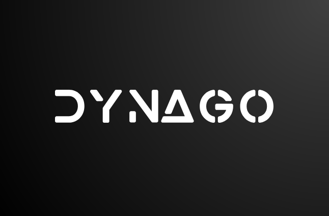
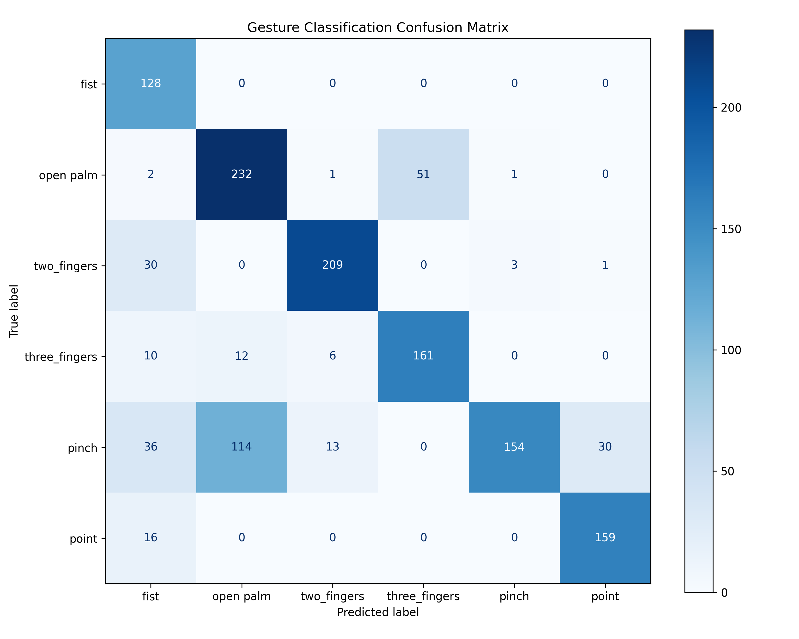
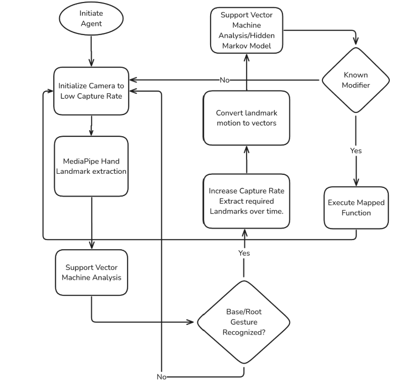

# 🦖 DyNaGO – Dynamic Natural Gesture Operations

DyNaGO is a real-time AI-powered, Human Computer Interface employing gesture recognition. It uses computer vision and machine learning to enable users to control their machines using natural, dynamic hand gestures—no special hardware required.

Whether for accessibility, low-interaction environments, or futuristic UI prototyping, DyNaGO delivers a lightweight, modular, and efficient solution for gesture-based computing.

---

## ✨ Features

- 🔧 **SVM + MediaPipe–based gesture classification**
- ⚡ **Dynamic velocity vector analysis** for real-time gesture detection
- 🎮 **System command mapping**: volume control, tab switching, app launch, and more
- 🖥️ **Fully functional on standard webcams**
- 🧱 **Modular architecture** – easily expandable with new gestures or models
- 🧪 **Trained on 4,200+ gesture samples** across 6 static classes

---

## 🧠 Dataset & Training Summary

- Total Samples: **4291**
- Gestures: `fist`, `two_fingers`, `three_fingers (2 types)`, `pinch`, `point`
- Normalization: **wrist-centered + scaled to unit sphere**
- Accuracy: **92.3%**
- Best Class: `point` (99.4%)
- Weakest Class: `pinch` (72.3%)

### Confusion Matrix Preview:

> 

---

## 🏗 System Architecture

> 

1. **Initialization** – Load webcam, environment, set base gesture
2. **Static Gesture Detection** – Classify using MediaPipe landmarks + SVM
3. **Motion Vector Analysis** – Track gesture trajectory using velocity between frames
4. **Action Mapping** – Trigger system functions via OS hooks / APIs

---

## 🛠 Usage

### Installation

```bash
git clone https://github.com/KreativeThinker/DyNaGO
cd DyNaGO
python -m venv .venv
source .venv/bin/activate
pip install poetry
poetry install
```

### Commands

| Command                   | Task                                       |
| ------------------------- | ------------------------------------------ |
| `poetry run capture`      | Capture training samples with label        |
| `poetry run normalize`    | Normalize and prepare dataset for training |
| `poetry run train_static` | Train SVM model                            |
| `poetry run dev`          | Launch dynamic gesture predictor           |

> \>\_ See all commands: [pyproject.toml](./pyproject.toml)

---

## 📈 Experiment Highlights

| Gesture         | Accuracy | AUC  | Confusions                              |
| --------------- | -------- | ---- | --------------------------------------- |
| `point`         | 99.4%    | 1.00 | minor confusion with `fist`             |
| `pinch`         | 72.3%    | 0.95 | major confusion with `palm` and `point` |
| `three_fingers` | 87.3%    | 1.00 | some confusion with `two_fingers`       |

> 📊 See full report: [Experiment Analysis](./Experiment_Analysis.md)

---

## 🎥 Demo

_Coming Soon — recording in progress. Will showcase real-time gesture use for volume control and workspace switching._

---

## 🌱 Future Work

- Better configuration file
- Hybrid dynamic gesture detection with light weight SVM + Velocity Vector Analysis
- Complete cursor control
- Real-time inference optimization (GPU support)
- Multi-gesture chaining (command macros)
- Browser-based version via TensorFlow.js
- Integrated Audio Agent with custom function execution (branch [voice](https://github.com/KreativeThinker/Dynago/tree/voice))

---

## 👨‍💻 Author

Built by [Anumeya Sehgal](https://github.com/KreativeThinker)  
✉ Email: [anumeyasehgal@proton.me](mailto:anumeyasehgal@proton.me)  
🌐 LinkedIn: [anumeya-sehgal](https://linkedin.com/in/anumeya-sehgal)

---

## 📜 License

[MIT License](./LICENSE) – Free for use, distribution, and enhancement.
